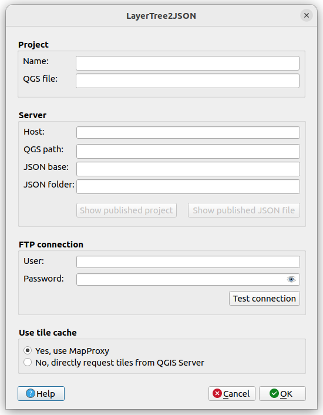
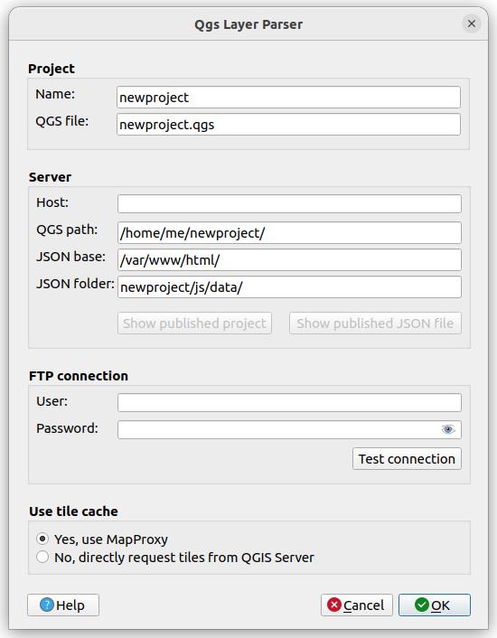
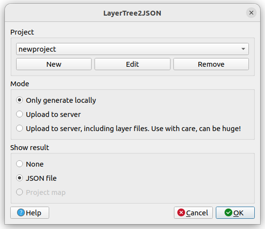
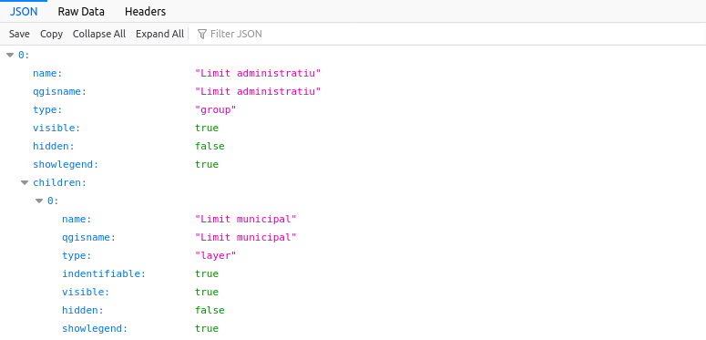
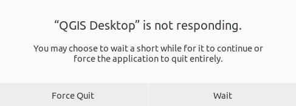

# LayerTree2JSON

QGIS plugin which writes a JSON config file with layer information for the open QGIS 3 project.

**LayerTree2JSON** makes it easy to syncronize your QGIS 3 proyect with a web map viewer. It parses the Qgis project and writes a JSON config file with layer information. Additionally it can handel the upload for you using SFTP.

*Notes:*

- It doesn't create a web map for you so, you still have to code your map and use the produced JSON file from their, for example to make a Layer Switcher.
- Additionally you need to set up QGIS Server to produce the WMS tiles.
- WFS right now is not supported out of the box, but will be soon.

## Installation

The plugin uses **pysftp** to upload the generated configuration files to a SFTP server. This Python library has some dependencies which can't be resolved easily on different operating systems, so for now you have to manually install pysftp:

1. Open console and go to `qgis_installation_directory\apps\Python39\Scripts\` (or just `OSGeo4W_installation_directoy` on Windows)
2. Type: `pip install pysftp`
3. Install the plugin from QGIS

## Configuration

Initially you have to add a new project clicking _New_ button:

You have to fill out at least the field *Project Name*. On clicking *OK* some fields are filled out using default values. Opening up the configuration window again clicking *Edit*, you should edit the fields *QGS file*, *QGS path*, *JSON path* and *JSON folder* to your server settings:

There are 2 important directories to use a web map with QGIS Server:

1. Path to QGIS file used by QGIS Server: This path is formed using *QGS path* plus *QGS file* fields, for example: `/home/me/newproject/newproject.qgs`
2. Path to JSON file used by web map: This path is formed using *JSON path* plus *JSON folder* plus the *QGS file* plus *.json*, for example: `/var/www/html/newproject/js/data/newproject.qgs.json`

*Note:* For now the name of the *QGS file* has to be exactly the same as the local .qgs file you use for this project.

## Test server connection

To test the server configuration, you have to fill out the field *Server Host*, which enables the buttons *Show published project* and *Show published JSON file*:

- **Show published project** opens a web browser with the URL build by *Host* plus *Name*, for example: `https://mymapserver.com/newproject/`. In this folder you should publish your web map.
- *Show published JSON file* opens a web browser with the URL build by *Host* plus *JSON folder*, for example: `https://mymapserver.com/newproject/js/data/newproject.qgs.json`

## FTP upload

To use the full power of the plugin and upload your settings to the server you also have to fill out *FTP User* and *FTP Password*. Then you should test the settings clicking the button *Test connection* which shows you the success using QGIS notifications.

## Use the plugin

The plugin does parse your active QGIS project and creates a JSON file with all your groups and layers. It reproduces the actual state of QGIS Layers Panel, so you should do the following preparations in order to get a nice result in your web map:

- Group, order and name your groups and layers as you would like to see them in your web map.
- Prepend character `@` to hide layers: This sets `"hidden": true` in JSON and could be used to tell the layer switcher to avoid showing a layer or group but render them by default.
- Prepend character `~` to hide the legend: This sets `"showLegend": false` in JSON could be used to avoid rendering the legend in layer switcher.
- Prepend character `¬` to load WMS layers directly: This sets `"external": true` in JSON. This option also looks up the layer source and writes the following parameters:
    - `"wmsUrl": ''`
    - `"wmsLayers": ''`
    - `"wmsProjection": ''`
    

Clicking *OK* starts the parser and saves the JSON file in the same folder of your .qgs file. By default is then opened in your default web browser:

If you would like to upload the produced JSON and the QGIS project file to a web server, you have to fill the related fields in project configuration and change to Mode *Upload to server*.

## FAQ

### After installing the plugin the following error message does show up: `ModuleNotFoundError: No module named 'pysftp'`

You have to install python library `pysftp` as explained in section *Installation*

### When uploading a project including layer files QGIS gets blocked and I see something like that:

Static layer files (like .shp, .gpkg, etc.) can be huge and uploading these files per FTP to the server can take a while. As the upload happens in the same thread, QGIS can get blocked for a while. This message will disappear automatically once the upload is finished.
